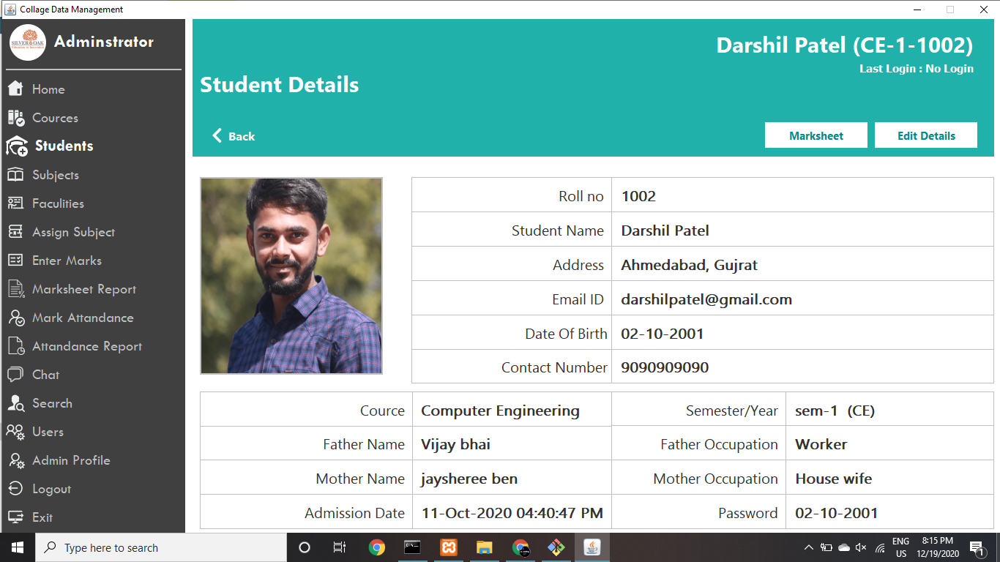

# College Management System In Java

## Hi there !

Here I have designed and developed College management system. The Technology I have used is Java Swing, and database i have used is MySql.
This design is purely coded myself no copied content.

Thanks !

## Features

 * Common Features 
      * Cources Management
      * Subjects Management
      * Students Management
      * Faculties Management
      * Students Attandance Management
      * Student Marks Management
 * Advance Features 🔥
      * Rollnumber Generator
      * Chatting
          * Message delivered
          * Unseen messages
          * Notification
          * Group chatting
      * Photo view of Students and Faculties
      * Student or Faculty login history
      * Download Marksheet
      * Notification
      * Declare result

## Installation

* Import this project into your IDE
* Create new Database and set name as 'collegedata' after that import 'collegedata.sql' file (Attached with this folder) in this database.

## Database Connection

* I have used following 👇 data for database connection
    * url="jdbc:mysql://localhost:3306/Collegedata";
    * user name="root";
    * password="";

* If you want to change this data then open ".\src\collegeapplication\common\DataBaseConnection.java"

## How to Run 

* Start Database Server
* Open "src/collegeapplication/chat/Server.java" and Run this file to start chat server
* Open "src/collegeapplication/login/LoginPageFrame.java" and Run this file to start application
* Admin userid : admin
* Admin password  : admin
* Faculty userid  : Faculty id
* Student Userid  : cource-sem-rollnumber (IT-1-1001)        

## Demo

https://user-images.githubusercontent.com/63580687/236466989-dc4c93f7-7f11-4bd6-9737-dbe43cbdfffd.mp4

## Screenshots

## About

My name is [Ajaysinh Rathod](https://github.com/Ajaysinh1290). I'm studying Information Technology (2nd Year) in SOCET(Ahmedabad). Contact me for any improvement in this project.

Email : ajaysinhrathod1290@gmail.com

# Social Media Accounts
&nbsp; &nbsp; &nbsp; &nbsp; &nbsp;
&nbsp; &nbsp; &nbsp; &nbsp; &nbsp; 
&nbsp; &nbsp; &nbsp; &nbsp; &nbsp; 

